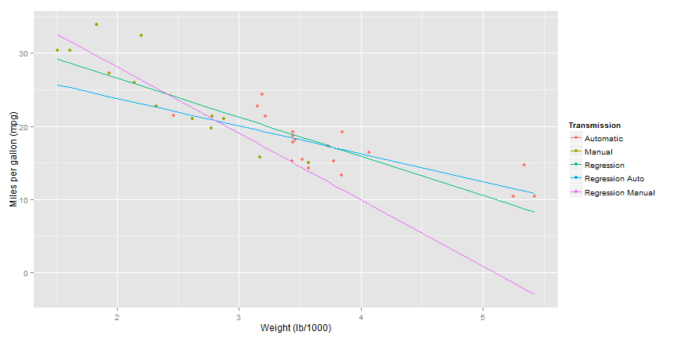

## The Problem

Are you:

- Buying a new car?
- Selling a car?
- Trying to save money on fuel?

You need to know the mileage you can expect to get out of your car. But how? Trying to calculate the mileage of a car yourself, you can encounter all sorts of problems, such as:

- Tricky and error prone measurements
- Boring maths
- Mind numbing apathy

Is there another way?

--- .class #id 

## The Solution

YES! 

Our state of the art prediction app can tell you the miles per gallon of your car with just the click of a button.

Simply enter the weight and transmission type of you car, and BOOM! Out comes the miles per gallon. It really is that easy!


```r
weight + transmission = mpg prediction
mpg prediction + you = profit
```

--- .class #id 

## Prediction...with SCIENCE

Our state of the art prediction algorithm utilizes strong correlation between car weight and miles per gallon performance, as shown in the following chart.

 

--- .class #id 

## Do it NOW

You can find out the miles per gallon of your car right now! Just follow these simple steps:

1. Go to https://michaelbausor.shinyapps.io/Project
2. Enter your car's weight and transmission type
3. Press submit
4. Victory!
